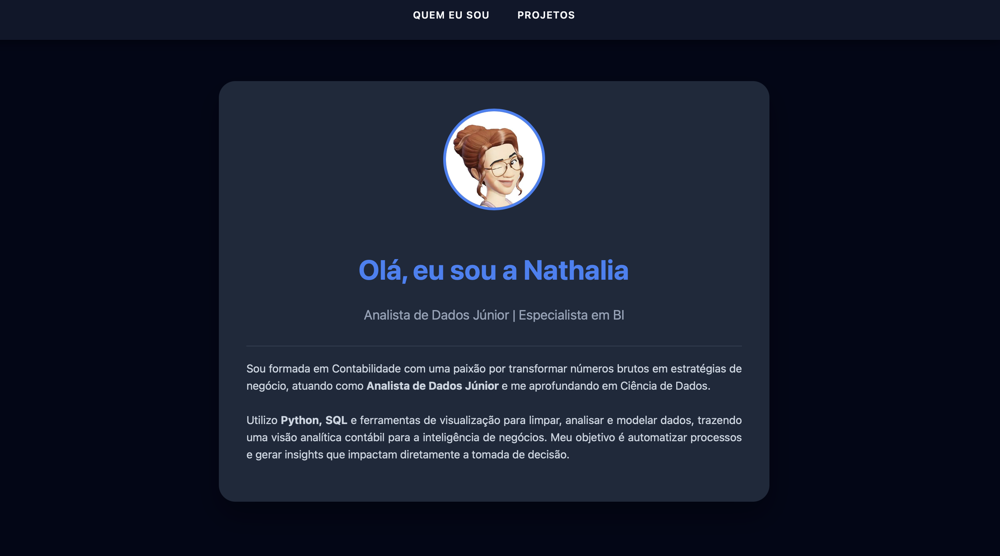

# 📊 Portfólio de Dados | Nathalia

Bem-vindo ao meu portfólio! Sou Analista de Dados com formação em Contabilidade e aqui apresento meus principais projetos, unindo inteligência de negócios, automação em Python e análise contábil.
Se quiser conferir, sinta-se à vontade para clicar: [portfolio-dados](https://nathaliamainenti.github.io/portfolio-dados/)

## 🚀 Tecnologias Utilizadas
- **Frontend:** HTML5, CSS3 (Flexbox/Grid), JavaScript (Fetch API).
- **Backend:** Python, FastAPI (hospedado no Render).
- **Data:** Pandas para manipulação de datasets.
- **Cloud:** GitHub Pages e Render.

## 📂 Projetos em Destaque

### 1. Disney Data Bot 🤖
Um assistente virtual que utiliza **Processamento de Linguagem Natural** simples para consultar uma base de dados histórica de filmes da Disney.
- **Destaque técnico:** Integração de uma API Python com uma interface web estática através de arquitetura RAG simples.

### 2. Projeto Titanic (Em desenvolvimento) 🚢
Modelo de Machine Learning para prever a probabilidade de sobrevivência de passageiros.

### 3. Retorno sobre Ação (Em desenvolvimento) 📈
Análise financeira de ROI focada em ativos contábeis.

---
## 👩‍💻 Sobre Mim
Atualmente atuo como Analista de Dados Júnior, focada em transformar números brutos em estratégias de negócio. Busco automatizar processos e gerar insights que impactam diretamente a tomada de decisão.

**Contatos:**
- [LinkedIn](https://www.linkedin.com/in/nathalia-mainenti-/)
- [E-mail](nathaliamainenti@gmail.com)

